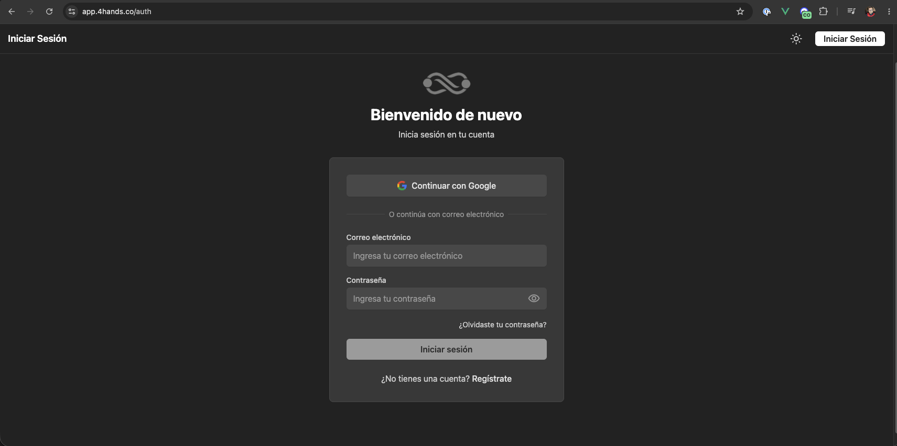
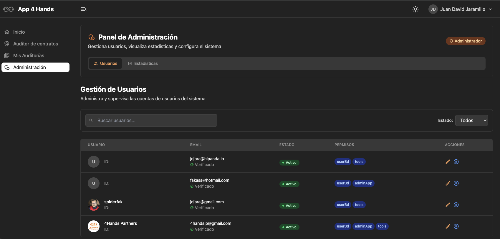
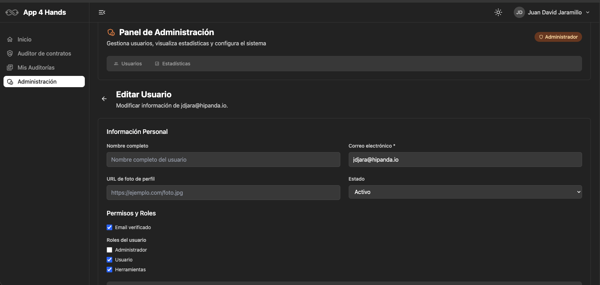
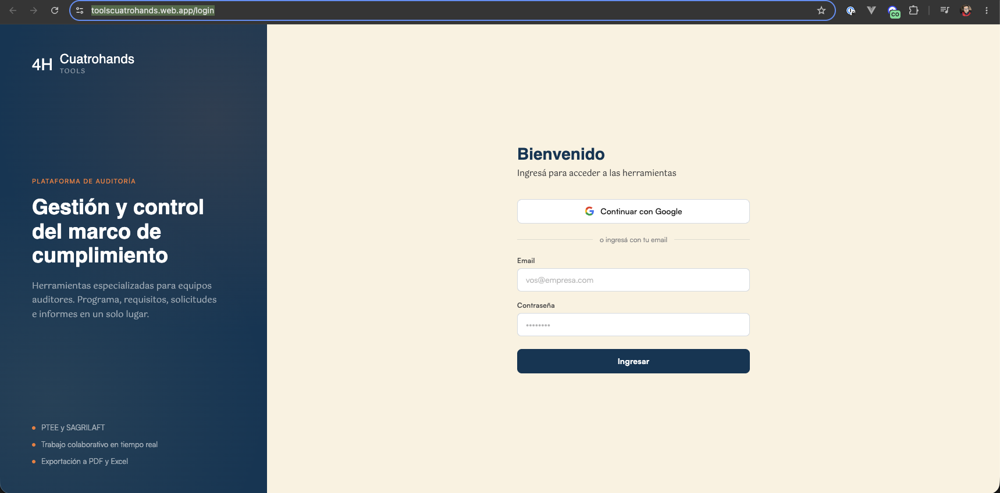

# Manual de Usuario — 4Hands Tools

Guía de configuración y acceso

---

## Antes de empezar

Este manual cubre dos procesos: el alta en el sistema central (`app.4hands.co`) y el acceso a la aplicación de herramientas (`toolscuatrohands.web.app`). El flujo completo requiere una acción de un administrador entre el registro y el primer ingreso a herramientas.

---

## Paso 1 — Registro en 4Hands central

Ingresá a **[app.4hands.co](https://app.4hands.co)** y hacé click en **"¿No tienes cuenta? Regístrate"**.

<figure>
  
  <figcaption>Pantalla de inicio de sesión — el enlace a registro está debajo del formulario</figcaption>
</figure>

Completá usuario y contraseña. El sistema enviará un correo de validación a la dirección registrada. Hay que hacer click en el enlace del correo antes de poder iniciar sesión.

---

## Paso 2 — Asignación del rol de herramientas

Este paso lo realiza **Yuly** (o cualquier usuario con rol de administrador) desde el panel de administración de `app.4hands.co`.

Ingresá al módulo de **edición de usuarios**:

<figure>
  
  <figcaption>Acceso al módulo de gestión de usuarios</figcaption>
</figure>

Buscá el usuario que va a usar la app de herramientas y asignale el rol **Herramientas**:

<figure>
  
  <figcaption>Selección del rol "Herramientas" en el perfil del usuario</figcaption>
</figure>

Sin este paso, el usuario no tendrá acceso a `toolscuatrohands.web.app`.

---

## Paso 3 — Acceso a la aplicación de herramientas

Una vez que el rol está asignado, el equipo puede ingresar a **[https://toolscuatrohands.web.app/login](https://toolscuatrohands.web.app/login)** usando el mismo usuario y contraseña creados en el **Paso 1**.

<figure>
  
  <figcaption>Pantalla de login de la aplicación de herramientas</figcaption>
</figure>

---

## Nota sobre el MVP

El sistema ya persiste datos en la base de datos. Sin embargo, dado que es un MVP, no se han implementado protecciones avanzadas contra sobrescritura simultánea. La recomendación operativa es que **cada miembro del equipo trabaje en un módulo diferente** para evitar conflictos de edición.

Si dos personas modifican el mismo registro al mismo tiempo, los cambios pueden sobrescribirse. Esto está dentro de lo esperado para esta etapa del producto.

---

## Resumen del flujo

| # | Acción | Destino |
|---|--------|---------|
| 1 | Registrarse | app.4hands.co |
| 2 | Validar correo | (link en inbox) |
| 3 | Admin asigna rol | app.4hands.co → admin |
| 4 | Ingresar a herramientas | toolscuatrohands.web.app/login |

Las credenciales son las mismas para ambos sistemas. El rol de administrador en `app.4hands.co` es el que determina quién puede asignar el rol de herramientas a otros usuarios.

---

<footer>
  
4Hands Tools

</footer>